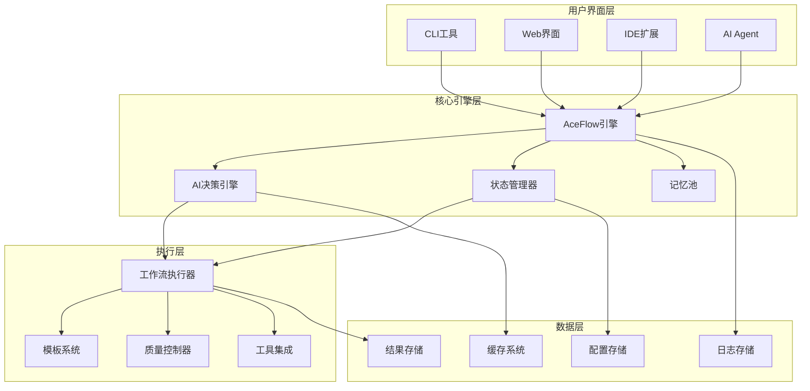

# AceFlow v3.0

<div align="center">


**AI驱动的软件开发工作流管理框架**

[](LICENSE)
[](https://www.python.org/downloads/)
[](https://github.com/aceflow/aceflow-pateoas-framework)
[](CONTRIBUTING.md)

[English](README_EN.md) | **中文** | [日本語](README_JA.md)

</div>

---

## 🎯 项目简介

AceFlow 是一个基于 **PATEOAS**（Prompt as the Engine of AI State）理念的智能软件开发工作流管理框架。它将传统软件工程最佳实践与AI智能决策相结合，为开发团队提供自适应、标准化、高效的开发流程管理。

### 🌟 核心特性

- **🧠 智能模式选择**: AI自动分析任务复杂度，推荐最优工作流程
- **🔄 自适应流程**: 支持轻量级、标准、完整三种流程模式
- **📊 状态驱动**: 基于项目状态和上下文进行智能工作流管理
- **🤖 AI深度集成**: 与主流AI Agent（Cline、Cursor、Copilot）无缝集成
- **📈 实时监控**: 可视化项目进度和质量指标
- **🛠️ 完整工具链**: CLI工具、Web界面、IDE扩展一体化

### 💡 设计理念

> **"让AI成为你的专业工作流管理助手"**

AceFlow 基于以下核心理念设计：
- **智能优先**: AI自动化决策，减少人工干预
- **标准驱动**: 遵循软件工程最佳实践
- **渐进增强**: 从轻量级到企业级的渐进式流程
- **开放集成**: 与现有开发工具生态深度集成

---

## 🚀 快速开始

### 📋 环境要求

- **Python**: 3.8+
- **操作系统**: Linux / macOS / Windows
- **IDE**: VSCode / Cursor (推荐)
- **AI服务**: OpenAI / Claude / 本地LLM (可选)

### ⚡ 5分钟快速体验

#### 1. 克隆项目
```bash
git clone https://github.com/aceflow/aceflow-pateoas-framework.git
cd aceflow-pateoas-framework
```

#### 2. 初始化 AceFlow
```bash
# 初始化项目（智能模式）
python3 .aceflow/scripts/aceflow init --mode smart

# 查看项目状态
python3 .aceflow/scripts/aceflow status
```

#### 3. 开始第一个工作流
```bash
# 智能分析任务
python3 .aceflow/scripts/aceflow analyze "开发用户登录功能"

# 开始开发工作流
python3 .aceflow/scripts/aceflow start --description "开发用户登录功能"

# 更新进度
python3 .aceflow/scripts/aceflow progress S1 80

# 完成阶段
python3 .aceflow/scripts/aceflow complete S1
```

#### 4. 查看结果
```bash
# 查看详细状态
python3 .aceflow/scripts/aceflow status --format json --verbose

# 查看生成的文档
ls aceflow_result/
```

---

## 📊 工作流模式

AceFlow 提供四种工作流模式，适应不同规模和复杂度的项目：

### 🔹 智能模式 (Smart Mode)
**最新特性** | **AI自动选择最优流程**

```yaml
特点: AI自动分析任务，选择最适合的工作流程
适用: 所有项目类型，推荐首选
流程: 动态调整，智能优化
```

### 🔸 轻量级模式 (Minimal Mode)
**快速迭代** | **P → D → R**

```yaml
适用场景: 1-5人小团队，Bug修复，快速原型
典型周期: 0.5-2天
阶段流程:
  P (规划): 需求分析，方案设计
  D (开发): 编码实现，测试验证  
  R (评审): 代码审查，发布准备
```

### 🔸 标准模式 (Standard Mode)
**平衡效率** | **P1 → P2 → D1 → D2 → R1**

```yaml
适用场景: 3-10人中型团队，新功能开发
典型周期: 3-7天
阶段流程:
  P1 (需求分析): 用户故事，业务分析
  P2 (技术设计): 架构设计，接口定义
  D1 (功能开发): 核心实现，单元测试
  D2 (质量验证): 集成测试，性能测试
  R1 (发布准备): 代码审查，部署准备
```

### 🔸 完整模式 (Complete Mode)
**严格质控** | **S1 → S2 → S3 → S4 → S5 → S6 → S7 → S8**

```yaml
适用场景: 10+人大型团队，关键系统，企业级项目
典型周期: 1-4周
完整流程:
  S1 (用户故事): 需求分析，角色定义
  S2 (任务分解): 详细规划，依赖分析
  S3 (测试设计): 测试策略，用例设计
  S4 (功能实现): 迭代开发，持续集成
  S5 (测试验证): 全面测试，质量保证
  S6 (代码评审): 代码审查，架构评估
  S7 (演示反馈): 用户验收，反馈收集
  S8 (总结归档): 项目总结，知识沉淀
```

---

## 🛠️ 核心功能

### 🎯 智能任务分析
```bash
# AI自动分析任务类型和复杂度
aceflow analyze "实现用户权限管理系统"
```

**输出示例**:
```
🧠 AI分析结果:
  任务类型: 新功能开发
  复杂度: 中等
  推荐模式: Standard
  预估时间: 5-7天
  置信度: 92%
```

### 📈 实时状态监控
```bash
# 可视化项目状态
aceflow status --format text
```

**状态展示**:
```
📊 AceFlow 项目状态
==========================================
项目: TaskMaster开发
模式: Standard | 团队: 5人 | 周期: 1周

整体进度: ████████░░ 80%
当前阶段: D1 - 功能开发 (90%)

阶段状态:
P1 需求分析    ✅ 完成 (100%)
P2 技术设计    ✅ 完成 (100%)  
D1 功能开发    🔄 进行中 (90%)
D2 质量验证    ⏳ 等待中
R1 发布准备    ⏳ 等待中

质量指标:
- 代码覆盖率: 85%
- 性能指标: 优秀
- 安全评分: A+
```

### 🤖 AI Agent 集成

AceFlow 与主流 AI Agent 深度集成，提供智能化开发体验：

#### Cline 集成
```markdown
# 在 Cline 中直接使用
"我要开发用户登录功能" 
→ 自动启动 AceFlow Standard 模式

"检查项目状态"
→ 展示详细的项目进度和建议

"我遇到了一个Bug"
→ 自动切换到 Minimal 模式快速修复
```

#### VSCode 扩展
```json
{
  "aceflow.autoDetect": true,
  "aceflow.mode": "smart",
  "aceflow.aiProvider": "claude"
}
```

---

## 📁 项目结构

```
aceflow-pateoas-framework/
├── .aceflow/                          # AceFlow核心目录
│   ├── aceflow-spec_v3.0.md          # 完整技术规范
│   ├── config/
│   │   └── project.yaml              # 项目配置
│   ├── state/
│   │   └── project_state.json        # 状态管理
│   ├── scripts/
│   │   └── aceflow                   # CLI工具
│   ├── templates/                    # 文档模板
│   └── memory/                       # AI记忆池
├── .clinerules/                      # AI集成规则
│   ├── aceflow_integration.md        # Cline集成配置
│   └── aceflow_v3_integration.md     # v3.0增强集成
├── aceflow_result/                   # 执行结果目录
├── taskmaster-api/                   # 示例API项目
├── taskmaster-web/                   # 示例Web项目
├── docs/                            # 完整文档
└── README.md                        # 项目说明
```

---

## 💻 使用示例

### 🎬 完整开发流程演示

#### 场景：开发一个任务管理API

```bash
# 1. 项目初始化
aceflow init --mode smart

# 2. AI智能分析
aceflow analyze "开发TaskMaster任务管理API，包含用户认证、任务CRUD、权限管理"

# 输出：
# 🧠 分析结果：
# 任务类型: 新功能开发
# 复杂度: 中等
# 推荐模式: Standard
# 预估时间: 1-2周

# 3. 开始开发工作流
aceflow start --description "开发TaskMaster任务管理API"

# 4. S1阶段 - 需求分析
# (AI会自动生成用户故事和验收标准)
aceflow progress P1 100
aceflow complete P1

# 5. S2阶段 - 技术设计  
# (AI辅助生成API设计和数据库设计)
aceflow progress P2 100
aceflow complete P2

# 6. S3阶段 - 功能开发
# (按照设计文档进行编码实现)
aceflow progress D1 50
# ... 继续开发 ...
aceflow progress D1 100
aceflow complete D1

# 7. 查看最终状态
aceflow status --format json
```

#### 生成的项目文档结构
```
aceflow_result/iter_20250711_143022/
├── P1_requirements/
│   ├── user_stories.md              # 用户故事
│   ├── acceptance_criteria.md       # 验收标准
│   └── business_analysis.md         # 业务分析
├── P2_design/
│   ├── api_design.md               # API设计文档
│   ├── database_schema.md          # 数据库设计
│   └── architecture_diagram.md     # 架构图
├── D1_implementation/
│   ├── development_log.md          # 开发日志
│   ├── code_structure.md           # 代码结构
│   └── unit_tests.md              # 单元测试报告
└── progress_summary.md             # 整体进度总结
```

---

## 🎨 可视化界面

### 📊 Web Dashboard
```bash
# 启动Web界面
aceflow web --port 8080

# 访问 http://localhost:8080
```

**Dashboard功能**:
- 📈 项目进度可视化
- 🎯 实时状态监控  
- 📋 任务分配管理
- 📊 质量指标统计
- 🤖 AI建议面板

### 🔧 VSCode集成界面

安装AceFlow VSCode扩展后，您将获得：

- **状态栏显示**: 实时显示当前阶段和进度
- **侧边栏面板**: 完整的项目状态概览
- **命令面板**: 快速执行AceFlow命令
- **智能提示**: 基于当前状态的开发建议

---

## 🔧 高级配置

### ⚙️ 项目配置文件
```yaml
# .aceflow/config/project.yaml
project:
  name: "我的项目"
  technology_stack: ["python", "fastapi", "vue"]
  team_size: 5

aceflow:
  default_mode: "smart"
  ai_assistance_level: "L2"  # L1=建议, L2=执行, L3=自主

workflow:
  auto_progress_tracking: true
  quality_gates_enabled: true
  stage_timeout_hours: 24

ai:
  providers:
    primary: "claude"
    fallback: "openai"
  confidence_threshold: 0.8

quality:
  testing:
    min_coverage: 80
  security:
    vulnerability_scan: true
```

### 🤖 AI服务配置
```bash
# 配置AI服务提供商
aceflow config --set ai.provider=claude
aceflow config --set ai.api_key=$CLAUDE_API_KEY

# 配置智能化级别
aceflow config --set ai.assistance_level=L2

# 启用自动化功能
aceflow config --set workflow.auto_progress_tracking=true
```

---

## 🏗️ 架构设计

### 🎨 系统架构图



### 🔄 状态管理机制

AceFlow 采用状态驱动的架构设计：

```json
{
  "project_id": "aceflow_20250711_001",
  "flow_mode": "smart",
  "current_stage": "D1", 
  "overall_progress": 65,
  "stage_states": {
    "P1": {"status": "completed", "progress": 100},
    "P2": {"status": "completed", "progress": 100},
    "D1": {"status": "in_progress", "progress": 80}
  },
  "ai_suggestions": [
    {
      "type": "optimization",
      "priority": "medium", 
      "description": "建议并行执行测试用例编写"
    }
  ],
  "memory_pool": {
    "requirements": [...],
    "decisions": [...],
    "issues": [...]
  }
}
```

---

## 🔌 集成生态

### 🛠️ 开发工具集成

| 工具类型 | 支持产品 | 集成程度 | 说明 |
|---------|---------|---------|------|
| **AI Agent** | Cline, Cursor, Copilot | ⭐⭐⭐⭐⭐ | 深度集成，自动化工作流 |
| **IDE** | VSCode, JetBrains | ⭐⭐⭐⭐ | 插件支持，实时状态同步 |
| **版本控制** | Git, GitHub, GitLab | ⭐⭐⭐⭐ | 自动提交，分支管理 |
| **CI/CD** | GitHub Actions, Jenkins | ⭐⭐⭐ | 自动化流水线触发 |
| **项目管理** | Jira, Trello, Notion | ⭐⭐⭐ | 任务同步，进度更新 |
| **通信工具** | Slack, Teams, 钉钉 | ⭐⭐ | 状态通知，进度推送 |

### 🔗 API集成示例

```python
# 与外部系统集成
from aceflow import AceFlowAPI

# 初始化API客户端
api = AceFlowAPI(project_root="./my-project")

# 获取项目状态
status = api.get_status()
print(f"当前进度: {status.overall_progress}%")

# 监听状态变化
@api.on_stage_complete
def handle_stage_complete(stage_info):
    # 自动通知团队
    slack.send_message(f"✅ {stage_info.name} 阶段完成!")
    
    # 自动创建下一阶段任务
    jira.create_task(stage_info.next_stage)

# 自定义质量门控
@api.on_quality_check
def custom_quality_gate(quality_metrics):
    if quality_metrics.coverage < 80:
        return False, "代码覆盖率不足80%"
    return True, "质量检查通过"
```

---

## 📚 完整文档

### 📖 用户文档
- [🚀 快速开始指南](docs/AceFlow_Quick_Start_Guide.md)
- [⚙️ 配置说明](docs/configuration.md)
- [🎯 最佳实践](docs/best-practices.md)
- [❓ 常见问题](docs/faq.md)

### 🔧 开发文档  
- [🏗️ 架构设计](docs/architecture.md)
- [🔌 API参考](docs/api-reference.md)
- [🧩 插件开发](docs/plugin-development.md)
- [🤝 贡献指南](CONTRIBUTING.md)

### 📝 技术规范
- [📋 AceFlow v3.0 完整规范](.aceflow/aceflow-spec_v3.0.md)
- [🤖 AI集成规范](.clinerules/aceflow_v3_integration.md)
- [🔄 工作流协议](docs/workflow-protocol.md)

---

## 🤝 参与贡献

我们欢迎任何形式的贡献！无论是新功能、Bug修复、文档改进还是使用反馈。

### 🎯 贡献方式

#### 🐛 报告问题
- 使用 [GitHub Issues](https://github.com/aceflow/aceflow-pateoas-framework/issues) 报告Bug
- 详细描述问题复现步骤
- 提供相关的日志和配置信息

#### 💡 功能建议
- 在 [Discussions](https://github.com/aceflow/aceflow-pateoas-framework/discussions) 中讨论新功能想法
- 描述使用场景和预期效果
- 参与社区投票和讨论

#### 🔧 代码贡献
```bash
# 1. Fork 项目
git clone https://github.com/your-username/aceflow-pateoas-framework.git

# 2. 创建功能分支
git checkout -b feature/amazing-feature

# 3. 提交更改
git commit -m "Add amazing feature"

# 4. 推送分支
git push origin feature/amazing-feature

# 5. 创建 Pull Request
```

#### 📚 文档贡献
- 改进现有文档
- 翻译多语言版本
- 添加使用示例和教程

### 🏆 贡献者

感谢所有为 AceFlow 做出贡献的开发者！

<div align="center">

</div>

---

## 📄 开源协议

本项目采用 [MIT License](LICENSE) 开源协议。

```
MIT License

Copyright (c) 2025 AceFlow Team

Permission is hereby granted, free of charge, to any person obtaining a copy
of this software and associated documentation files (the "Software"), to deal
in the Software without restriction, including without limitation the rights
to use, copy, modify, merge, publish, distribute, sublicense, and/or sell
copies of the Software, and to permit persons to whom the Software is
furnished to do so, subject to the following conditions:

The above copyright notice and this permission notice shall be included in all
copies or substantial portions of the Software.
```

---

## 📞 社区支持

### 💬 获取帮助
- **官方文档**: [https://docs.aceflow.dev](https://docs.aceflow.dev)
- **GitHub Issues**: [问题报告和功能请求](https://github.com/aceflow/aceflow-pateoas-framework/issues)
- **Discussions**: [社区讨论](https://github.com/aceflow/aceflow-pateoas-framework/discussions)
- **Discord**: [加入Discord社区](https://discord.gg/aceflow)

### 📧 联系我们
- **邮箱**: hello@aceflow.dev
- **Twitter**: [@AceFlowDev](https://twitter.com/AceFlowDev)
- **微信群**: 添加微信 `aceflow-bot` 加入技术交流群

### 🗺️ 路线图

查看我们的 [项目路线图](https://github.com/aceflow/aceflow-pateoas-framework/projects) 了解未来发展计划：

- **Q1 2025**: Web界面完善、插件生态
- **Q2 2025**: 企业版功能、高级集成
- **Q3 2025**: 云端服务、团队协作增强
- **Q4 2025**: 国际化支持、生态扩展

---

## ⭐ Star History

如果 AceFlow 对您有帮助，请给我们一个 ⭐ Star！

[](https://star-history.com/#aceflow/aceflow-pateoas-framework&Date)

---

<div align="center">

**🚀 让AI驱动软件开发工作流，提升团队效率和代码质量 🚀**

[开始使用](docs/AceFlow_Quick_Start_Guide.md) • [查看文档](docs/) • [加入社区](https://discord.gg/aceflow)

---

*用 ❤️ 构建，为了更好的软件开发体验*

</div>